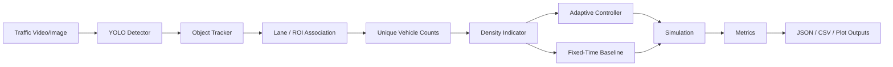

# TrafficPilot AI

[](https://github.com/TanaySurya-369/Adaptive-Traffic-Control-YOLOv11/actions/workflows/ci.yml)


TrafficPilot AI is a computer-vision-based adaptive traffic-control research prototype that combines YOLO vehicle detection, object tracking, lane/ROI association, lane-level traffic-density indicators, rule-based signal control, and simulation-based comparison against a fixed-time baseline.

YOLO11 is retained as the reproducible academic baseline. The detector is model-path configurable, so any compatible Ultralytics checkpoint can be supplied, but this repository does not claim benchmark results for untested models.

## Key capabilities

- End-to-end detection command for video/image inputs using an Ultralytics-compatible YOLO checkpoint.
- Configurable confidence threshold, IoU threshold, image size, device, tracker name, vehicle classes, output directory, ROI file, frame limit, and annotated-video export.
- Saved ROI JSON support for reproducible lane definitions.
- Unique per-lane vehicle counting when tracking IDs are available.
- Lane-level traffic-density indicator calculated as `vehicle_count / road_length`.
- Rule-based adaptive signal controller with a documented green-time equation.
- Fixed-time controller baseline using equivalent initial traffic conditions.
- Headless deterministic simulation and benchmark commands that do not require YOLO weights, GPU, or a display.
- JSON/CSV reports and optional benchmark plots generated only from actual run data.
- Pytest test suite, Ruff linting, and GitHub Actions CI.

## What this is not

TrafficPilot AI is not a production traffic-management system. The repository does not implement live CCTV deployment, a dashboard, reinforcement learning, multi-intersection coordination, pedestrian control, emergency-vehicle priority, or ground-truth YOLO accuracy/mAP benchmarking.

## Architecture



See [`docs/architecture.md`](docs/architecture.md) and [`docs/project-facts.md`](docs/project-facts.md) for the canonical implementation facts.

## Installation

### Windows PowerShell

```powershell
git clone https://github.com/TanaySurya-369/Adaptive-Traffic-Control-YOLOv11.git
cd Adaptive-Traffic-Control-YOLOv11
python -m venv .venv
.venv\Scripts\Activate.ps1
python -m pip install --upgrade pip
python -m pip install -e .[dev]
```

For YOLO/OpenCV detection:

```powershell
python -m pip install -e .[vision,dev]
```

For optional benchmark plots:

```powershell
python -m pip install -e .[plots,dev]
```

### Linux/macOS

```bash
git clone https://github.com/TanaySurya-369/Adaptive-Traffic-Control-YOLOv11.git
cd Adaptive-Traffic-Control-YOLOv11
python -m venv .venv
source .venv/bin/activate
python -m pip install --upgrade pip
python -m pip install -e .[dev]
```

## Quick start without YOLO weights

```bash
python -m trafficpilot simulate --scenario mixed --seed 42 --duration 60
python -m trafficpilot benchmark --runs 3 --duration 60 --seed 42
```

## YOLO detection workflow

Model weights are not committed. Download a compatible YOLO11 checkpoint, such as `yolo11x.pt`, into `models/` from a source you are licensed to use.

Validate inputs and ROI without loading a model:

```bash
python -m trafficpilot detect --input lane0.mp4 lane1.mp4 lane2.mp4 lane3.mp4 --roi configs/rois/example.json --dry-run
```

Run detection and write a JSON report:

```bash
python -m trafficpilot detect \
  --input path/to/video.mp4 \
  --roi configs/rois/example.json \
  --model models/yolo11x.pt \
  --output outputs/detections
```

Write an annotated MP4 as well:

```bash
python -m trafficpilot detect \
  --input path/to/video.mp4 \
  --roi configs/rois/example.json \
  --model models/yolo11x.pt \
  --annotate \
  --output outputs/detections
```

## Configuration

`configs/default.yaml` centralizes model, traffic, controller, simulation, metrics, and output settings. Important defaults include:

- vehicle class IDs `[2, 3, 5, 7]` for car, motorcycle, bus, and truck;
- YOLO model path `models/yolo11x.pt`;
- tracker `bytetrack.yaml`;
- adaptive green time `min(max_green, min_green + vehicles * extra_green_per_vehicle)`;
- fixed green time `30` seconds;
- seed `42` for reproducible scenario generation.

## Outputs

Generated outputs are ignored by Git and written under `outputs/` by default.

- Simulation: `outputs/reports/simulation.json`
- Benchmark: `outputs/reports/benchmark.json` and `outputs/reports/benchmark.csv`
- Detection: `outputs/detections/detection_report.json`
- Optional annotated videos: `outputs/detections/*_annotated.mp4`
- Optional plots: user-specified PNG path, for example `outputs/reports/benchmark.png`

## Evaluation

Traffic-control evaluation compares adaptive and fixed-time controllers under the same initial lane counts in the deterministic simulation. Detection evaluation is separate. The repository includes a detection pipeline, but no labeled dataset is committed, so it does not report precision, recall, F1, mAP, FPS, latency, or accuracy by default.

See [`docs/evaluation.md`](docs/evaluation.md) and [`docs/verification.md`](docs/verification.md).

## Repository structure

```text
.
├── configs/                 # default config and ROI examples
├── docs/                    # architecture, facts, evaluation, limitations, verification
├── examples/                # tested example commands/scripts
├── scripts/                 # helper scripts
├── src/trafficpilot/        # canonical package implementation
│   ├── control/             # adaptive and fixed-time controllers
│   ├── detection/           # detector wrapper, tracking helper, detection pipeline
│   ├── metrics/             # traffic-control metrics helpers
│   ├── reporting/           # JSON, CSV, optional plot reporting
│   └── traffic/             # ROI, counting, density, scenarios
├── tests/                   # unit and CLI tests
├── outputs/.gitkeep         # generated outputs location; contents ignored
├── pyproject.toml           # packaging/tooling/dependencies
├── requirements.txt         # compatibility installer
└── run.py                   # minimal wrapper around trafficpilot.cli
```

## Roadmap

Planned work, not implemented unless explicitly stated:

- Add ground-truth detection evaluation for precision, recall, F1, mAP@50, and mAP@50:95.
- Add richer tracker experiments after validating tracker compatibility and behavior.
- Add calibrated traffic/fuel/emission modeling.
- Add optional ONNX/TensorRT export guidance after testing.
- Explore pedestrian-aware control, emergency-vehicle priority, multi-intersection coordination, and reinforcement learning as research extensions.

## Academic credit

Original academic project identity: **Adaptive Traffic Control Using YOLO**.

Academic contributors identified in project materials:

- V. T. Surya Vardhan
- Goli Jahnavi
- Shaik Salman
- Project guide: S. Tulasi Prasad

Repository engineering updates should be distinguished from the original academic authorship.

## License and third-party software

The repository code is licensed under the MIT License. Runtime dependencies and model checkpoints have separate license terms. Review [`THIRD_PARTY_NOTICES.md`](THIRD_PARTY_NOTICES.md) before redistribution or commercial use.
