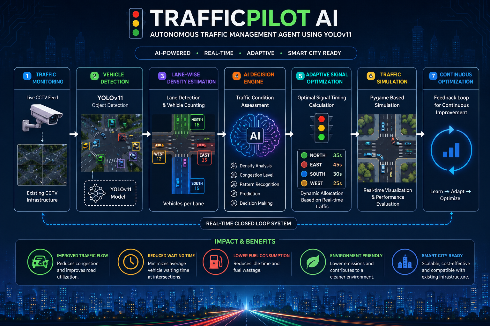

# 🚦 TrafficPilot AI

### Autonomous Traffic Management Agent using YOLOv11

An AI-powered autonomous traffic management agent that monitors CCTV
traffic feeds, detects vehicles using **YOLOv11**, estimates lane-wise
traffic density, and dynamically optimizes traffic signal timings in
real time.


------------------------------------------------------------------------

## 📖 Table of Contents

-   Demo
-   Features
-   Motivation
-   System Architecture
-   AI Agent Workflow
-   Project Structure
-   Installation
-   Quick Start
-   Usage
-   Dataset & Model Weights
-   Results
-   Screenshots
-   Future Roadmap
-   Contributing
-   License
-   Authors
-   Citation

------------------------------------------------------------------------

# 🎬 Demo

TrafficPilot AI continuously monitors traffic through CCTV footage,
detects vehicles using YOLOv11, estimates lane-wise congestion, and
dynamically adjusts traffic signal timings using a Pygame-based traffic
simulation.

> **Tip:** Add a GIF at `README_ASSETS/demo.gif` for a more engaging
> project page.

### Simulation Preview


------------------------------------------------------------------------

# ✨ Features

-   🚗 Real-time vehicle detection using YOLOv11
-   🚦 Dynamic traffic signal optimization
-   🧠 Autonomous AI decision engine
-   📹 CCTV-based traffic monitoring
-   📊 Lane-wise traffic density estimation
-   🎮 Pygame traffic simulation
-   ⚡ Low-cost solution using existing surveillance cameras
-   🌍 Smart city ready architecture
-   📈 Reduced waiting time and improved traffic flow

------------------------------------------------------------------------

# 🎯 Motivation

Traditional fixed-time traffic signals cannot adapt to changing traffic
conditions. TrafficPilot AI improves urban mobility by analyzing live
traffic, estimating congestion, and allocating green signal time
intelligently to reduce waiting time, fuel consumption, and emissions.

------------------------------------------------------------------------

# 🏗️ System Architecture

> Replace the image below with your architecture diagram if available.



------------------------------------------------------------------------

# 🧠 AI Agent Workflow

``` text
CCTV Video Feed
        │
        ▼
YOLOv11 Vehicle Detection
        │
        ▼
Lane-wise Traffic Density Estimation
        │
        ▼
AI Decision Engine
        │
        ▼
Adaptive Signal Timing
        │
        ▼
Pygame Traffic Simulation
        │
        ▼
Continuous Real-Time Optimization
```

------------------------------------------------------------------------

# 📂 Project Structure

``` text
Adaptive-Traffic-Control-YOLOv11/
│
├── docs/
├── images/
├── papers/
├── scripts/
├── examples/
├── sample_videos/
├── README_ASSETS/
├── Merges.py
├── run.py
├── requirements.txt
├── LICENSE
├── CONTRIBUTING.md
└── README.md
```

------------------------------------------------------------------------

# ⚙️ Installation

``` bash
git clone https://github.com/TanaySurya-369/Adaptive-Traffic-Control-YOLOv11.git

cd Adaptive-Traffic-Control-YOLOv11

python -m venv .venv

# Windows
.venv\Scripts\activate

# Linux/macOS
source .venv/bin/activate

pip install -r requirements.txt
```

------------------------------------------------------------------------

# 🚀 Quick Start

``` bash
mkdir -p models

# Download official YOLOv11x weights
# Save as:
# models/yolo11x.pt

python Merges.py --input sample_videos/simulated_file_1.mp4 --mode detect

python Merges.py --mode simulate
```

------------------------------------------------------------------------

# 💻 Usage

``` bash
python run.py --mode detect --input sample_videos/simulated_file_1.mp4 --weights models/yolo11x.pt

python run.py --mode simulate
```

------------------------------------------------------------------------

# 📦 Dataset & Model Weights

Model weights are not included due to their size.

Save the official YOLOv11x weights as:

``` text
models/yolo11x.pt
```

> Do not commit model weights to the repository.

------------------------------------------------------------------------

# 📊 Results

The project demonstrates:

-   Reduced average waiting time
-   Improved traffic throughput
-   Adaptive signal allocation
-   Better traffic flow using computer vision
-   Lower idle time and fuel consumption (simulation)

------------------------------------------------------------------------

# 📸 Screenshots

Replace or extend these with additional screenshots.


------------------------------------------------------------------------

# 🛣️ Future Roadmap

-   Emergency vehicle prioritization
-   Multi-intersection coordination
-   Pedestrian detection
-   Live CCTV deployment
-   Cloud dashboard
-   Traffic analytics
-   IoT integration

------------------------------------------------------------------------

# 🤝 Contributing

Contributions are welcome.

1.  Fork the repository.
2.  Create a feature branch.
3.  Commit your changes.
4.  Open a Pull Request.

Please read **CONTRIBUTING.md** before contributing.

------------------------------------------------------------------------

# 📜 License

Distributed under the MIT License.

------------------------------------------------------------------------

# 👨‍💻 Authors

-   Tanay Surya Vaikuntapu
-   S. Tulasi Prasad
-   Goli Jahnavi
-   Tanay Surya Vardhan
-   Shaik Salman

------------------------------------------------------------------------

# 📚 Citation

``` bibtex
@misc{trafficpilotai2025,
  title={TrafficPilot AI: Adaptive Traffic Control using YOLOv11},
  author={Tanay Surya Vaikuntapu and S. Tulasi Prasad and Goli Jahnavi and Tanay Surya Vardhan and Shaik Salman},
  year={2025},
  howpublished={https://github.com/TanaySurya-369/Adaptive-Traffic-Control-YOLOv11}
}
```

------------------------------------------------------------------------

# ⭐ Support

If you find this project useful, consider giving the repository a ⭐ on
GitHub.
