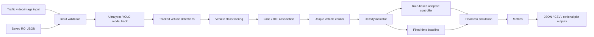

# Architecture

TrafficPilot AI now has one canonical implementation under `src/trafficpilot`.



## Detection

The detection command validates input files, loads an Ultralytics-compatible checkpoint, runs `model.track()`, filters vehicle classes, assigns bounding-box centers to lane ROIs, counts unique track IDs per lane, and writes a structured detection report. Optional annotated MP4 output can be enabled with `--annotate`.

## Controller mathematics

The adaptive controller is rule-based, not learned. For each lane:

```text
green_time = min(max_green, min_green + vehicles * extra_green_per_vehicle)
```

At each adaptive cycle, lanes are sorted by descending queue length. The fixed-time controller uses one constant green duration per lane. Benchmark comparisons use equivalent initial lane counts for both controllers.

## Headless simulation

The modern simulation path models deterministic queue service without opening a GUI window. This keeps CI and reproducible benchmarks independent from Pygame, GPUs, or YOLO weights.
